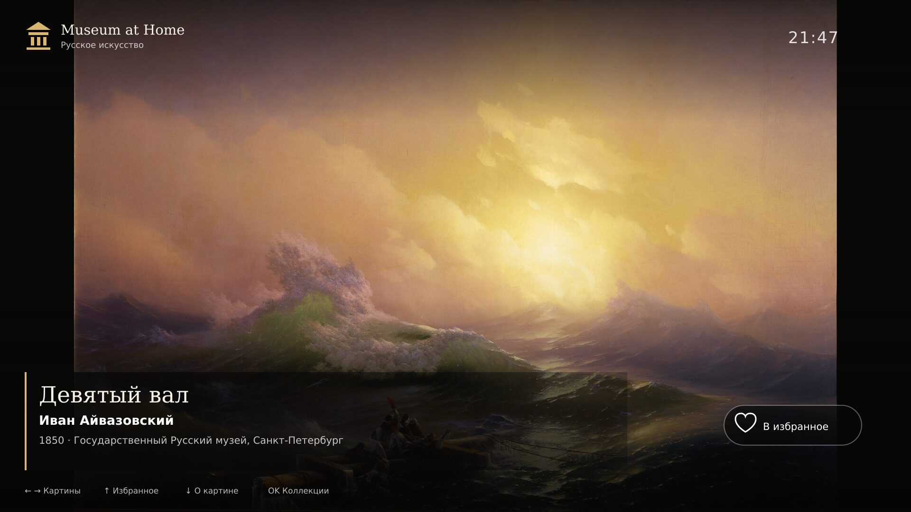

# Museum at Home

### Turn the largest screen in your home into a quiet, curated gallery

## One gallery, several television platforms

Museum at Home is a full-screen gallery with a shared TV-first interface for LG
webOS, Android TV / Google TV, Amazon Fire TV, Samsung Tizen and web browsers.
Packaged builds bundle local reproductions; platform wrappers and installation
requirements differ. A gallery app is not a guaranteed system screensaver.

**v2.1.2:** the user confirmed installation through webOS Dev Manager on a Mac
and working gallery operation on **LG49UH610V, webOS 3.4**. This is not proof of
universal device compatibility, hours-long stability or hardware offline testing.

| Platform | Package | Status |
|---|---|---|
| LG webOS 3+ | v2.1.2 1080p `.ipk`; 720p via CI | Gallery confirmed on LG49UH610V / webOS 3.4; system screensaver not confirmed |
| Android TV / Google TV | Debug `.apk` | Sideload testing; DreamService selection varies by firmware |
| Amazon Fire TV | Android `.apk` | Supported for sideload testing |
| Samsung Smart TV / Tizen | Unsigned Tizen web project | Requires TV certificate and device testing |
| Modern television browser | PWA / static web build | Supported where browser APIs allow |
| Apple TV / Roku / VIDAA | Native port required | Roadmap |

## Highlights

- 80 rights-checked artworks: 32 Russian and 48 world works; 25 Russian additions;
- Russian and world collections, favorites, genres and periods;
- complete RU/EN titles, artists, museums, dates, stories, rights and input hints;
- cached focus geometry and no button transitions for older TV engines;
- three higher-quality replacements, the correct Van Gogh *Café Terrace at Night*
  painting, and Kuindzhi’s 1882 Tretyakov repetition correctly identified;
- new reproductions at 2000–2560 px on the long side, without AI upscaling;
- calm crossfades and optional gentle motion;
- auto-hiding UI for a quiet full-screen gallery;
- D-pad, Magic Remote, Samsung Remote and Android Back handling in the shared UI;
- automated rights audit, ES5 compatibility tests and multi-platform CI.

Choose your language for installation guides, architecture and contributor
documentation:

### [Read the English documentation →](README.en.md)

### [Открыть документацию на русском →](README.ru.md)

## Download and next steps

The [v2.1.2 release](https://github.com/Saborrr/museum-at-home/releases/tag/v2.1.2)
contains **only LG 1080p**:
[`museum-at-home-webos-1080-2.1.2.ipk`](https://github.com/Saborrr/museum-at-home/releases/download/v2.1.2/museum-at-home-webos-1080-2.1.2.ipk),
73,141,544 bytes, built with the official `ares-package`. This is a Developer Mode
test package, not a store release. Current builds for the other platforms are
[CI artifacts](https://github.com/Saborrr/museum-at-home/actions);
[older v2.1.1 builds](https://github.com/Saborrr/museum-at-home/releases/tag/v2.1.1)
are separate and do not include the v2.1.2 changes. See the language guides for
Mac/webOS Dev Manager and CLI installation.

The commercial plan is a **free 80-work base gallery plus future paid thematic
collections**. Checkout, entitlement restoration and a store listing are not
implemented; a subscription is not a decided model. Priorities: LG store
eligibility and seller payouts, then downloadable packs with entitlements and
restore after reinstall; other platforms follow later.

Created and maintained by **[Saborrr](https://github.com/Saborrr)**.
