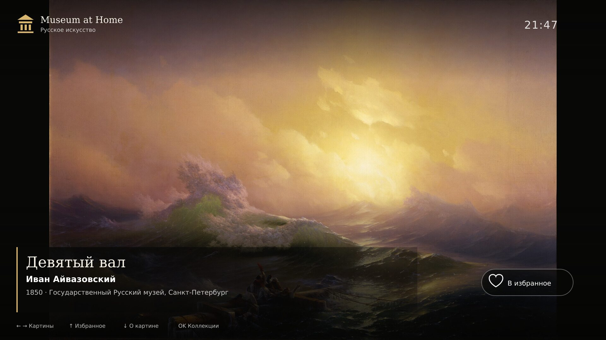

<div align="center">


# Museum at Home

### Спокойная мультиязычная художественная галерея для телевизоров

[Главная](README.md) · [English](README.en.md) · **Русский**

[](https://github.com/Saborrr/art-screensaver-webos/actions)
[](docs/CONTENT_POLICY.md)
[](https://webostv.developer.lge.com/develop/specifications/web-api-and-web-engine)



</div>

## Что это такое

Museum at Home превращает телевизор в ненавязчивый домашний музей. Интерфейс
изначально разработан для управления пультом и просмотра с расстояния: крупный
текст, безопасные отступы, понятный фокус, отсутствие мелких элементов и полная
работа без интернета в сборках для телевизоров.

Через 12 секунд бездействия подписи, часы и элементы управления плавно
скрываются, оставляя на экране только картину. Любая кнопка пульта или движение
указателя возвращает интерфейс. В настройках можно выбрать режим **Авто** или
**Всегда**.

## Возможности

- коллекции русского и мирового искусства;
- фильтры: пейзаж, портрет, реализм, романтизм, импрессионизм, Возрождение,
  барокко и модернизм;
- избранное с переносом данных из прежней версии;
- подробные истории картин на русском и английском;
- плавная смена изображений без черного кадра;
- необязательное мягкое движение камеры;
- локальные репродукции для работы без интернета;
- PWA-кэширование для версии, размещенной на сайте;
- допуск картин в релиз только после проверки источника и прав;
- ES5-код для старых webOS 3.x и ранних телевизоров Samsung Tizen.

## Поддерживаемые платформы

| Платформа и распространенные марки | Формат | Поддержка и ограничения |
|---|---|---|
| **LG webOS 3+** | Два пакета `.ipk` | Полная поддержка приложения. Расширенный режим системной галереи включается только на моделях LG, где он предусмотрен прошивкой. |
| **Android TV / Google TV** — Sony, Philips, TCL, Xiaomi, некоторые Hisense, Nvidia Shield | Android `.apk` | Полный интерфейс для пульта и зарегистрированная служба Android DreamService. Возможность выбрать стороннюю системную заставку зависит от прошивки телевизора. |
| **Amazon Fire TV** | Тот же Android `.apk` | Полноэкранная галерея и управление пультом. Для проверки устанавливается через ADB; поддержка DreamService зависит от версии Fire OS. |
| **Samsung Smart TV / Tizen** | Неподписанный Tizen-проект | Поддерживаются интерфейс и кнопка Return. Перед установкой Samsung требует сертификат разработчика, связанный с конкретным телевизором. |
| **Браузер телевизора / мини-ПК / киоск** | Статический сайт или PWA | Работает через HTTPS или локальный веб-сервер. Браузерная версия не может заменить защищенную системную заставку производителя. |
| **Apple TV** | Пока нет | Для tvOS необходимо отдельное нативное приложение на SwiftUI. |
| **Roku** | Пока нет | Для Roku требуется отдельное приложение SceneGraph / BrightScript. |
| **VIDAA и закрытые системы** | Браузерная версия, если доступна | Для публикации в магазине нужен SDK производителя и партнерская регистрация. |

Общий интерфейс используется повторно, а платформенные оболочки отвечают за
запуск из меню телевизора, кнопку Back, упаковку и требования магазинов.

## Качество на 4K-телевизорах

LG ограничивает графику web-приложений разрешением 1920×1080 даже на UHD-моделях;
3840×2160 доступно видеослою. Поэтому Museum at Home использует чистые и
аккуратно сжатые репродукции с полезным размером около 1920 пикселей, не расходуя
память на данные, которые телевизор все равно уменьшит. Android, Samsung и
браузерные сборки используют тот же качественный набор и всегда сохраняют
пропорции картины через `object-fit: contain`.

## Управление пультом

| Кнопка | Действие |
|:---:|---|
| `←` / `→` | Предыдущая / следующая картина |
| `↑` или красная | Добавить в избранное или удалить из него |
| `↓` или желтая | Открыть подробную историю |
| `OK`, зеленая или синяя | Коллекции и настройки |
| `Back`, `Return` или `Esc` | Закрыть окно или выйти |

## Где скачать готовые сборки

Откройте [GitHub Actions](https://github.com/Saborrr/art-screensaver-webos/actions),
выберите последний успешный запуск **Museum at Home CI** и скачайте:

- `museum-at-home-webos` — два файла `.ipk` для LG, 1080p и 720p;
- `museum-at-home-cross-platform` — тестовый APK для Android TV, ZIP с
  браузерной/PWA-версией и неподписанный ZIP для Samsung Tizen.

Эти артефакты предназначены для проверки. Для публикации в магазинах нужны
личные ключи подписи и аккаунты продавца.

## Установка на LG webOS

Установите официальные инструменты LG:

```bash
npm install -g @webos-tools/cli
ares-setup-device
ares-novacom --device myTV --getkey
ares-device --device myTV --system-info
```

На UHD-телевизорах, включая LG 49UH610V, используйте пакет 1080p:

```bash
ares-install --device myTV путь/к/1080/com.saborrr.museumathome_2.1.0_all.ipk
ares-launch --device myTV com.saborrr.museumathome
```

Сессия Developer Mode имеет срок действия. Продлевайте ее в приложении
Developer Mode до окончания таймера.

## Установка на Android TV / Google TV / Fire TV

Включите на телевизоре параметры разработчика и ADB, после чего установите APK
из кроссплатформенного артефакта:

```bash
adb connect IP_АДРЕС_ТЕЛЕВИЗОРА
adb install -r museum-at-home-android-tv-debug.apk
```

Для магазина необходимо собрать и подписать release APK или AAB собственным
ключом. Отладочный файл из CI намеренно не является магазинным релизом.

## Установка на Samsung Tizen

Samsung требует подписывать каждое TV-приложение авторским и дистрибьюторским
сертификатами, включающими DUID конкретного телевизора. Импортируйте неподписанный
ZIP-проект в Tizen Studio или расширение Samsung для VS Code, создайте профиль
сертификата, соберите `.wgt` и установите его на зарегистрированный телевизор.

Финальную подпись нельзя безопасно выполнять открытым кодом: сертификат автора
и его пароль нельзя добавлять в GitHub.

## Запуск как сайта или PWA

```bash
npm run build:platforms
npx --yes http-server dist/web -p 8080
```

Для локальной проверки откройте `http://localhost:8080`. Для установки PWA и
работы сервис-воркера разместите содержимое `dist/web` на HTTPS-сайте.

## Разработка

```bash
npm test                       # каталог, пульты, ES5 и платформы
npm run audit:rights:refresh  # повторная проверка источников и лицензий
npm run validate              # проверка всех релизных изображений
npm run build                 # папки LG 1080p и 720p
npm run build:platforms       # web, Tizen и синхронизация Android
```

Общая схема сборки:

```text
data/*.json + img/paintings/*
              ↓ проверка прав и файлов
       единый телевизионный ES5-интерфейс
          ↓         ↓         ↓
     LG webOS   Android APK   Tizen / PWA
```

## Права на контент

В коммерческую сборку входят 55 проверенных работ. Две спорные репродукции
заблокированы, еще одна работа CC BY-SA не попадает в релиз до завершения
правильного механизма атрибуции. Результаты поисковой выдачи не считаются
доказательством разрешения. Подробнее: [политика контента и прав](docs/CONTENT_POLICY.md).

## Дальнейшие планы

- автоматическая подписанная сборка через зашифрованные секреты репозитория;
- магазинные версии Android TV и Fire TV;
- проверка на реальном Samsung и подписанный релиз `.wgt`;
- дополнительные коллекции и загружаемые тематические наборы;
- нативные версии Apple TV, Roku и VIDAA после стабилизации общего каталога;
- подписка и премиальные музейные подборки.

## Автор

Создатель и разработчик проекта: **[Saborrr](https://github.com/Saborrr)**.

Код приложения распространяется на условиях действующей лицензии репозитория
«все права защищены». Права на картины и репродукции учитываются отдельно для
каждой записи каталога.
